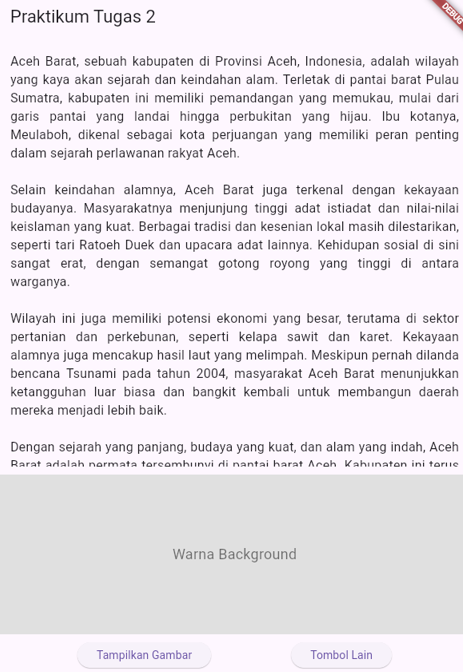
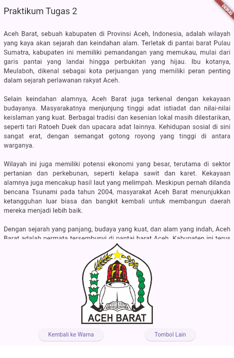
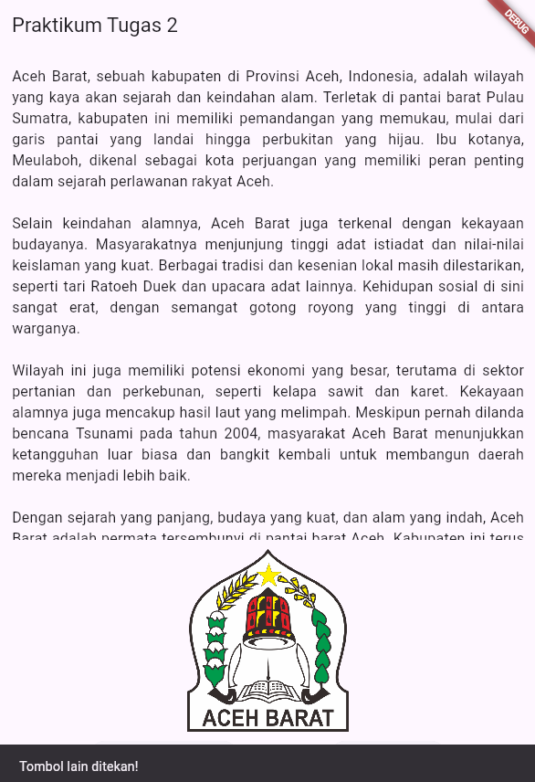

# Praktikum Flutter: Scroll, Layout, dan Event Gambar Dinamis

Proyek ini menampilkan fungsionalitas dasar Flutter: layout, scrolling, dan event handling, dengan tema yang didedikasikan untuk Aceh Barat.

## Tampilan Aplikasi

| Tampilan Awal | Tampilan Setelah Tombol Ditekan | SnackBar Tombol Lain |
| :---: | :---: | :---: |
|  |  |  |
